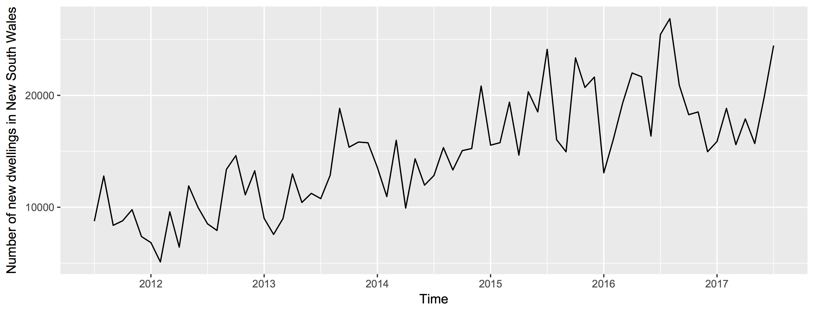

## ABS exercise

Main purpose: given housing data from the Australian Bureau of Statistics, transform SDMX JSON into timestamp-indexed tabular format, then perform modeling to come up with a 3-year forecast. Subtasks as outlined below.

In this README, I will walk the reader through the steps that I took to transform the data and to try to come up with a useful forecast. Although the code is written in R for the very simple reason that I am more familiar with it, I found a very similar way to implement the code in python, but I could not fully implement that due to lack of time. 

## Requirements

I used packages dplyr, jsonlite, tidyjson, tidyr, forecast, and ggplot
tidyjson requires installation through 

    devtools::install_github("sailthru/tidyjson")

### Task 1: transform JSON into tabular

Data was read into R using [tidyjson](), which I was not familiar with before, but seems to allow very neat navigation and extraction from json files.

    json = read_json('ABS_data.json')

and then data wrangling was done to get data into a tabular format. In the code below, data are transformed to a tibble and the json object is navigated to get to the target information in the SDMX-JSON format, namely 'observations'

    jsonTabular = 
    json %>% as.tbl_json %>%                                # conver to tibble
    enter_object('dataSets') %>%                            # enter dataSets object to dive into data
    gather_array %>%                                        # enter array
    enter_object('observations') %>%                        # enter observations
    gather_keys() %>%                                       # get they keys, which will be decoded  
    gather_array %>%                                        # enter the array
    append_values_number('array_values') %>%                # get the array value data
    data.frame()                                            # convert into df

Next I create keys for each of the fields and separate by ':' to get each field separately

    keys = paste0('key', 1:8)                               # prepare keys

    jsonTabularExpanded = 
    jsonTabular %>% separate(key, keys, ':')                # separate each of the 8 keys into a column

Get rid of seemingly non-informative columns, rename main data column to make it more informative:

    jsonTabularFiltered = 
    jsonTabularExpanded %>% select(-c('key1', 'key2', 'key3', 'key5', 'key7')) %>%  # get rid of non-informative keys
    filter(array.index == 1)                                                        # keep only index 1, corresponding to number of dwelling units

    jsonTabularFiltered = 
    jsonTabularFiltered %>% rename(Number.of.new.dwelling.units = array_values)     # rename main 

Next up, I generate a general lookup table from the raw json, similar to what I did before to get to the 'observations' section within the JSON. In this case, I need to get to all the 'keyPositions' and get their names

    generalLUT = json %>% as.tbl_json %>%
    enter_object('structure') %>% 
    enter_object('dimensions') %>% 
    enter_object('observation') %>%                         # navigate to 'observation level'
    gather_array %>%                                        # Dive into each array element
    spread_values(keyPosition = jstring('keyPosition'), name = jstring('name')) %>% # Keep keyPosition and name information
    enter_object('values') %>%                              # enter values array to get the encoding for keys 4, 6, and 8 (building type, region and time period)
    gather_array %>%                                        # Dive into each array element
    spread_values(array_value = jstring('name')) %>%        # Keep meaningful name for every index position within array 
    mutate(array_key = array.index - 1)                     # Add a column for 0-based indexing of array keys

I will generate a LUT (lookup table) for each variable I want to keep: building type, region and timestamp

    buildingTypeLUT = generalLUT %>% filter(keyPosition == 3) %>% select(c(array_key, array_value)) 
    regionLUT = generalLUT %>% filter(keyPosition == 5) %>% select(c(array_key, array_value)) 
    timestampLUT = generalLUT %>% filter(name == 'Time') %>% select(c(array_key, array_value)) 

And then map these onto the jsonTabular object, also handling conversin of timestamps to date format:

    jsonTabularAnnotated = 
    jsonTabularFiltered %>% mutate(building_type = recode(key4, !!!buildingTypeLUT)) %>% # buildingType LUT
    mutate(region = recode(key6, !!!regionLUT)) %>%                                      # region LUT
    mutate(timestamp = recode(key8, !!!timestampLUT)) %>%                                # time LUT
    mutate(timestamp = as.Date(paste('01', timestamp, sep = '-'), format = '%d-%b-%Y'))  # convert 

Clean up once more to get the final object to work with:

    jsonTabularAnnotated = 
    jsonTabularAnnotated %>% select(-c(document.id, array.index, key4, key6, key8))     # get rid of non-informative columns

And index by timestamp:

    jsonTabularAnnotated = 
    jsonTabularAnnotated %>% select(c(timestamp, building_type, region, Number.of.new.dwelling.units)) %>% # select final columns in correct order
    arrange(timestamp) # arrange by timestamp

### Task 2: extract time series for New South Wales

First, a short sanity check to see that I can really get the expected number of new Houses in New South Wales for July 2011: 

    jsonTabularAnnotated %>% filter(region == 'New South Wales') %>% 
    filter(timestamp == '2011-07-01', building_type == 'Houses') 

And now up to the task of extracting the time series for New South Wales. Since there are multiple building types, first I want to aggregate all of them in a single variable called 'Total number of new dwellings'

    aggrPerRegion = 
    jsonTabularAnnotated %>% 
    group_by(timestamp, region) %>% 
    summarise(total = sum(Number.of.new.dwelling.units))

And now get the aggregate number of new dwelling for New South Wales (NSW) only:

    aggrNSW = aggrPerRegion %>% filter(region == 'New South Wales')

Sanity check to make sure that values align with an independent extraction:

    jsonTabularAnnotated %>% 
    filter(region == 'New South Wales') %>% 
    filter(timestamp == '2011-07-01') %>%
    summarise(total = sum(Number.of.new.dwelling.units))

### Task 3: 3-year forecast

I will be using the ['forecast']() package to have a go at forecasting the time series. 

**Important note**: since I was not familiar with forecasting models before this task, the first thing I did was inform myself to have a guide. I worked through [this datacamp course](https://campus.datacamp.com/courses/forecasting-using-r/) to get acquainted with methods and concepts, which will be applied to the best of my judgement in the following sections.

First convert data to a time series. For the purpose of the exercise and simplicity, I decided to focus on total number of new dwellings (regardless of builsing type) in New South Wales only.

    tsdataNSW = ts(aggrNSW[,'total'], start = c(2011, 7), end = c(2017, 7),  frequency = 12)

Plot to see the time series of new dwellings in New South Wales between 2011 and 2017

    autoplot(tsdataNSW)

or alternatively using the worked through json file and ggplot2:

    ggplot(aggrNSW, aes(timestamp, total)) + 
    geom_line() + 
    scale_x_date('month') + 
    ylab('Number of new dwellings') + 
    xlab('')

Both should give the same end result:

        
      
#### Using ARIMA models

### Challenges and conclusions

Finally, I would like to spend a few lines on the challenges that this exercise posed, how I tried to tackle them, as well as on some of the thoughts and conclusions I was able to draw from the exercise. 

#### Challenges

1. Challenge # 1: reading a json file into R and **navigating it**
    1. The answer here was not too
2. Challenge # 2: Understand the structure of the SDMX-JSON
3. Challenge # 3: Working with time series
4. Challenge # 4: Understanding basics of forecasting
5.  

#### Thoughts and conclusions - a.k.a. 'how I would do things differently if faced with the same task again'

1. I learned about tidyjson and know how to use it and how to navigate, gather arrays and expand on relevant sections of data. Happy that I found the tidy version of a json reader!
2. SDMX-JSON structure: not sure I would greatly support this kind of data presentation...but I know how to wrap my head around it and handle it now!
3. Working with time series: difficult, but fun! I really enjoyed the course I worked through from Robert Hyndman, kudos to him for the great teaching material he has all over the web!
4. Basics of forecasting: I'm obviously still in my infancy regarding my understanding of forecasting models, but I have at least grasped basic concepts, such as seasonality, trends, ETS models, ARIMA models and how to evaluate those!