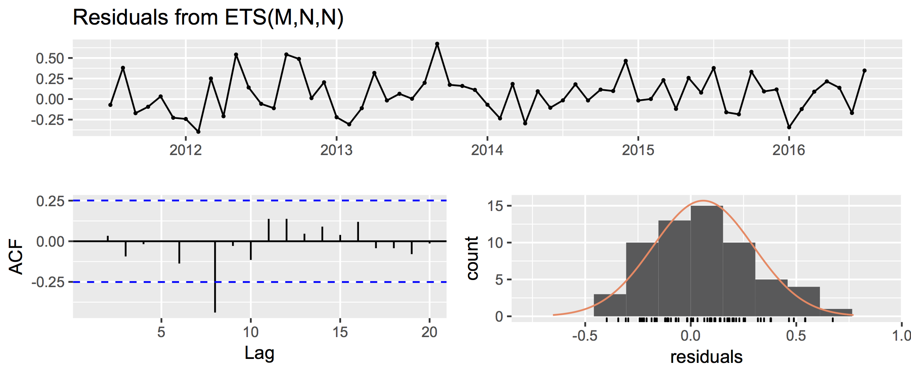
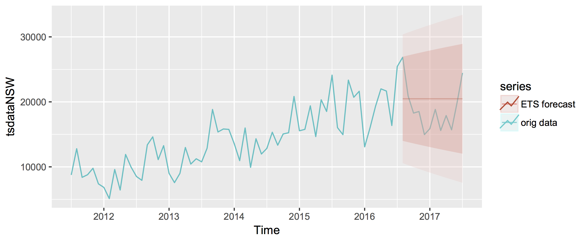
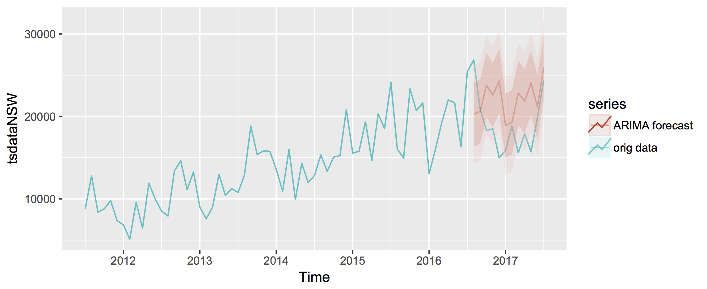
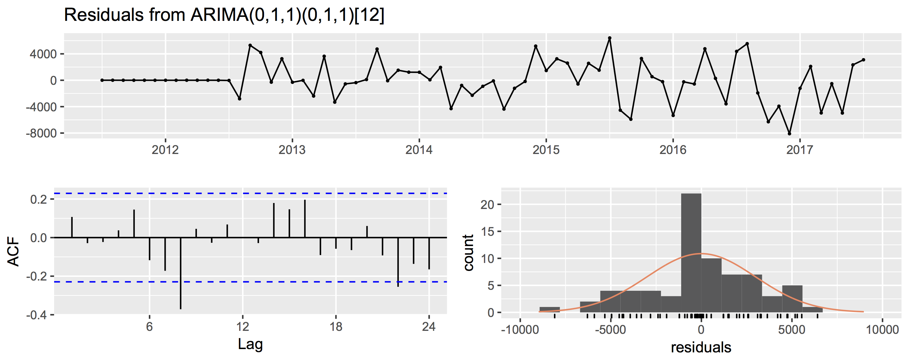
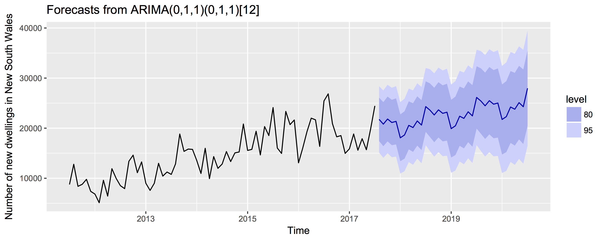

## ABS exercise

Main purpose: given housing data from the Australian Bureau of Statistics, transform SDMX JSON into timestamp-indexed tabular format, then perform modeling to come up with a 3-year forecast. Subtasks as outlined below.

In this README, I will walk the reader through the steps that I took to transform the data and to try to come up with a useful forecast. Although the code is written in R for the very simple reason that I am more familiar with it, I found a very similar way to [implement the code in python](https://towardsdatascience.com/an-end-to-end-project-on-time-series-analysis-and-forecasting-with-python-4835e6bf050b), but I could not develop that due to lack of time. 

## Requirements

I used packages dplyr, jsonlite, tidyjson, tidyr, forecast, and ggplot
tidyjson requires installation through 

    devtools::install_github("sailthru/tidyjson")

### Task 1: transform JSON into tabular

Data was read into R using [tidyjson](https://github.com/sailthru/tidyjson), which I was not familiar with before, but seems to allow very neat navigation and extraction from json files.

    json = read_json('ABS_data.json')

and then data wrangling was done to get data into a tabular format. In the code below, data are transformed to a tibble and the json object is navigated to get to the target information in the SDMX-JSON format, namely 'observations'

    jsonTabular = 
    json %>% as.tbl_json %>%                                # conver to tibble
    enter_object('dataSets') %>%                            # enter dataSets object to dive into data
    gather_array %>%                                        # enter array
    enter_object('observations') %>%                        # enter observations
    gather_keys() %>%                                       # get they keys, which will be decoded  
    gather_array %>%                                        # enter the array
    append_values_number('array_values') %>%                # get the array value data
    data.frame()                                            # convert into df

Next I create keys for each of the fields and separate by ':' to get each field separately

    keys = paste0('key', 1:8)                               # prepare keys

    jsonTabularExpanded = 
    jsonTabular %>% separate(key, keys, ':')                # separate each of the 8 keys into a column

Get rid of seemingly non-informative columns, rename main data column to make it more informative:

    jsonTabularFiltered = 
    jsonTabularExpanded %>% select(-c('key1', 'key2', 'key3', 'key5', 'key7')) %>%  # get rid of non-informative keys
    filter(array.index == 1)                                                        # keep only index 1, corresponding to number of dwelling units

    jsonTabularFiltered = 
    jsonTabularFiltered %>% rename(Number.of.new.dwelling.units = array_values)     # rename main 

Next up, I generate a general lookup table from the raw json, similar to what I did before to get to the 'observations' section within the JSON. In this case, I need to get to all the 'keyPositions' and get their names

    generalLUT = json %>% as.tbl_json %>%
    enter_object('structure') %>% 
    enter_object('dimensions') %>% 
    enter_object('observation') %>%                         # navigate to 'observation level'
    gather_array %>%                                        # Dive into each array element
    spread_values(keyPosition = jstring('keyPosition'),     # Keep keyPosition and name           information
    name = jstring('name')) %>% 
    enter_object('values') %>%                              # enter values array to get the encoding for keys 4, 6, and 8 (building type, region and time period)
    gather_array %>%                                        # Dive into each array element
    spread_values(array_value = jstring('name')) %>%        # Keep meaningful name for every index position within array 
    mutate(array_key = array.index - 1)                     # Add a column for 0-based indexing of array keys

I will generate a LUT (lookup table) for each variable I want to keep: building type, region and timestamp

    buildingTypeLUT = generalLUT %>% filter(keyPosition == 3) %>% select(c(array_key, array_value)) 
    regionLUT = generalLUT %>% filter(keyPosition == 5) %>% select(c(array_key, array_value)) 
    timestampLUT = generalLUT %>% filter(name == 'Time') %>% select(c(array_key, array_value)) 

And then map these onto the jsonTabular object, also handling conversin of timestamps to date format:

    jsonTabularAnnotated = 
    jsonTabularFiltered %>% mutate(building_type = recode(key4, !!!buildingTypeLUT)) %>% # buildingType LUT
    mutate(region = recode(key6, !!!regionLUT)) %>%                                      # region LUT
    mutate(timestamp = recode(key8, !!!timestampLUT)) %>%                                # time LUT
    mutate(timestamp = as.Date(paste('01', timestamp, sep = '-'), format = '%d-%b-%Y'))  # convert 

Clean up once more to get the final object to work with:

    jsonTabularAnnotated = 
    jsonTabularAnnotated %>% select(-c(document.id, array.index, key4, key6, key8))     # get rid of non-informative columns

And index by timestamp:

    jsonTabularAnnotated = 
    jsonTabularAnnotated %>% select(c(timestamp, building_type, region, Number.of.new.dwelling.units)) %>% # select final columns in correct order
    arrange(timestamp) # arrange by timestamp

### Task 2: extract time series for New South Wales

First, a short sanity check to see that I can really get the expected number of new Houses in New South Wales for July 2011: 

    jsonTabularAnnotated %>% filter(region == 'New South Wales') %>% 
    filter(timestamp == '2011-07-01', building_type == 'Houses') 

And now up to the task of extracting the time series for New South Wales. Since there are multiple building types, first I want to aggregate all of them in a single variable called 'Total number of new dwellings'

    aggrPerRegion = 
    jsonTabularAnnotated %>% 
    group_by(timestamp, region) %>% 
    summarise(total = sum(Number.of.new.dwelling.units))

And now get the aggregate number of new dwelling for New South Wales (NSW) only:

    aggrNSW = aggrPerRegion %>% filter(region == 'New South Wales')

Sanity check to make sure that values align with an independent extraction:

    jsonTabularAnnotated %>% 
    filter(region == 'New South Wales') %>% 
    filter(timestamp == '2011-07-01') %>%
    summarise(total = sum(Number.of.new.dwelling.units))

### Task 3: 3-year forecast

I will be using the ['forecast'](https://cran.r-project.org/web/packages/forecast/index.html) package to have a go at forecasting the time series. 

**Important note**: since I was not familiar with forecasting models before this task, the first thing I did was inform myself to have a guide. I worked through [this datacamp course](https://campus.datacamp.com/courses/forecasting-using-r/) and [this book](https://otexts.org/fpp2/limits.html) to get acquainted with methods and concepts, which will be applied to the best of my judgement in the following sections.

First convert data to a time series. For the purpose of the exercise and simplicity, I decided to focus on total number of new dwellings (regardless of builsing type) in New South Wales only.

    tsdataNSW = ts(aggrNSW[,'total'], start = c(2011, 7), end = c(2017, 7),  frequency = 12)

Plot to see the time series of new dwellings in New South Wales between 2011 and 2017

    autoplot(tsdataNSW)

or alternatively using the worked through json file and ggplot2:

    ggplot(aggrNSW, aes(timestamp, total)) + 
    geom_line() + 
    scale_x_date('month') + 
    ylab('Number of new dwellings') + 
    xlab('')

Both should give the same end result:

It looks like there's both a trend and a seasonal component. The seasonal plot clearly shows that the latest years have more total number of new dwellings:

Next I will decompose and plot seasonal and trend componentes to visualize them better:

    decompose(tsdataNSW) %>% autoplot()

The plot shows a clear upward trend, as well as a seasonal component. Next I will try to find the most appropriate models to forecast. 

#### ETS and ARIMA models

First let's try fitting an ETS model. Split the data into train and test to evaluate accuracy, take only the last 12 months as the test set.

    train = subset(tsdataNSW, end = length(tsdataNSW) - 12)

Fit the ETS model:

    ets = train %>% ets()                               # fit model
    checkresiduals(ets)
    summary(ets)                                        # check residuals   
    fcETS = forecast(ets, h = 12)                       # forecast last 12 months of data, compare to 
    accuracy(fcETS, tsdataNSW)                          # check accuracy based on RSME on train and test set, looks pretty bad
    autoplot(tsdataNSW, series = 'orig data') +         # visualize overlap of forecast with original data aes(alpha = 0.5)     
    aes(alpha = 0.5) +         
    autolayer(fcETS, series = 'ETS forecast') 

Checking the residuals of the model shows that they are quite close to being normally distributed, although the Ljung-Box test is actually significant.

Plotting the predicted time series in the test set (the last 12 months of the time series) makes it obvious that this was not the optimal forecast:

#### Using ARIMA models

I will now try to fit an ARIMA model to the data and come up with a better forecast. Since the data have a seasonal components, I will be specifying the seasonal component of the model. In an attempt to systematize the process, I will scan the whole parameter space for values between 0 and 1 for p, d, q, P, D and Q, producing 64 models.

Generate the parameter space and come up with a function that will iterate through the parameters and record AICc values, as well as RSME values for the test set:

    paramSpace = expand.grid(p = 0:1, d = 0:1, q = 0:1, P = 0:1, D = 0:1, Q = 0:1)

    aiccs = list()          # container elment for AICc values
    rsme = list()           # container element for test set rsme values

    scanParam = function(){
        for (i in 1:nrow(paramSpace)){
            print(i)
            tryCatch({    
                fit = Arima(train, order=c(paramSpace$p[i],paramSpace$d[i],paramSpace$q[i]), 
                seasonal = list(order = c(paramSpace$P[i],paramSpace$D[i],paramSpace$Q[i]), period = 12),
                method = 'ML', include.constant = TRUE)
                fcOnTestSet = forecast(fit, h = 12)
                acc = accuracy(fcOnTestSet, tsdataNSW)    
                    }, error=function(e) {cat('error calculating ARIMA model, skipping...')})
            aiccs[[i]] = fit$aicc
            rsme[[i]] = acc[4]                                                                  # 4 is the position of the test set RSME
            cat(
                'model parameters: ',
                '(', 
                paste(paramSpace$p[i],paramSpace$d[i],paramSpace$q[i], sep = ','),
                ')',
                '(P,D,Q)',
                '(',
                paste(paramSpace$P[i],paramSpace$D[i],paramSpace$Q[i],sep = ','),
                ')',
                ' [12]',
                paste('aicc is: ', fit$aicc),
                paste('RSME is: ',acc[[4]])
                )
            }
        return(list(aiccs, rsme))
    }

Execute the function, then get the minimum value for AICc and print out the parameter combination:

    scanningOutput = scanParam()
    
    minAICc = grep(min(unlist(scanningOutput[[1]])), scanningOutput[[1]])       #scanningOutput[[1]] contains AICc values

    print(paramSpace[minAICc,])

It looks like the best model is one with parameters:

(0,1,1) (0,1,1) [12]

So I will now fit that model to the training data and visualize its performance on the test set:

    fit = Arima(train, order=c(0,1,1), seasonal = list(order = c(0,1,1), period = 12),
                method = 'ML', include.constant = TRUE)
    fcARIMAOnTestSet = forecast(fit, h = 12)
    acc = accuracy(fcARIMAOnTestSet, tsdataNSW)    

    autoplot(tsdataNSW, series = 'orig data') +                         # visualize overlap of forecast with original data aes(alpha = 0.5)              
    autolayer(fcARIMAOnTestSet, series = 'ARIMA forecast', 
    alpha = 0.3) 

It's not a perfect fit but it seems to be capturing the seasonality and the forecast ist reasonably close to the 12 last months of data that were reserved for evaluation. 

Finally, let's produce the forecast for the 3 years as requested in the exercise and check the residuals:

    fit = Arima(tsdataNSW, order=c(0,1,1), seasonal = list(order = c(0,1,1), period = 12),
                method = 'ML')
    fcARIMA = forecast(fit, h = 36)
    checkresiduals(fit)

These look reasonsably normally distributed and the Ljung-Box test is non-significant, although borderline, probably due to the first flat part of the residuals data.

Finally, let's plot the 3 year forecast:

The prediction seems to be good enough in capturing the upward trend and some of the seasonality, although some more transformations may be needed to provide an even better fit for the seasonality component. 

## Conclusions and thoughts

I came up with an ARIMA model that does a reasonable prediction of 3 years ahead for the number of new dwellings in New South Wales. There are clearly points of improvement, especially regarding capturing the seasonality of the time series. A couple of thoughts on how to proceed here:

1. An obvious way to go would be to scan a wider parameter space and see if there are any parameter combinations that would yield a better forecast
2. Apply a neuronal network approach to forecast, as described [here](https://blogs.rstudio.com/tensorflow/posts/2017-12-20-time-series-forecasting-with-recurrent-neural-networks/) or [here](http://kourentzes.com/forecasting/2017/02/10/forecasting-time-series-with-neural-networks-in-r/)
3. A big limitation in this particular time series is that there is limited historical information about the dwellings so it's very hard to make an accurate prediction for 3 years ahead. Other sources of information might help in improving the forecast.
4. There is a package from Robert Hyndman to do multiseries forecasting and to integrate better with the tidyverse called [fable](https://github.com/tidyverts/fable), which might be worth trying for this purpose, especially to evaluate forecasts for other time series, such as those grouped by region or building type.

### Challenges and personal conclusions

Finally, I would like to spend a few lines on the challenges that this exercise posed, how I tried to tackle them, as well as on some of the thoughts and conclusions I was able to draw from the exercise. 

#### Challenges

1. Challenge # 1: reading a json file into R and navigating it
2. Challenge # 2: Understand the structure of the SDMX-JSON
3. Challenge # 3: Working with time series
4. Challenge # 4: Understanding basics of forecasting

#### Thoughts and conclusions on the personal side

1. I learned about tidyjson and know how to use it and how to navigate, gather arrays and expand on relevant sections of data. Happy that I found the tidy version of a json reader!
2. SDMX-JSON structure: not sure I would greatly support this kind of data presentation...but I know how to wrap my head around it and handle it now!
3. Working with time series: difficult, but fun! I really enjoyed the course I worked through from Robert Hyndman, kudos to him for the great teaching material he has all over the web!
4. Basics of forecasting: I'm obviously still in my infancy regarding my understanding of forecasting models, but I have at least grasped basic concepts, such as seasonality, trends, ETS models, ARIMA models and how to evaluate those!